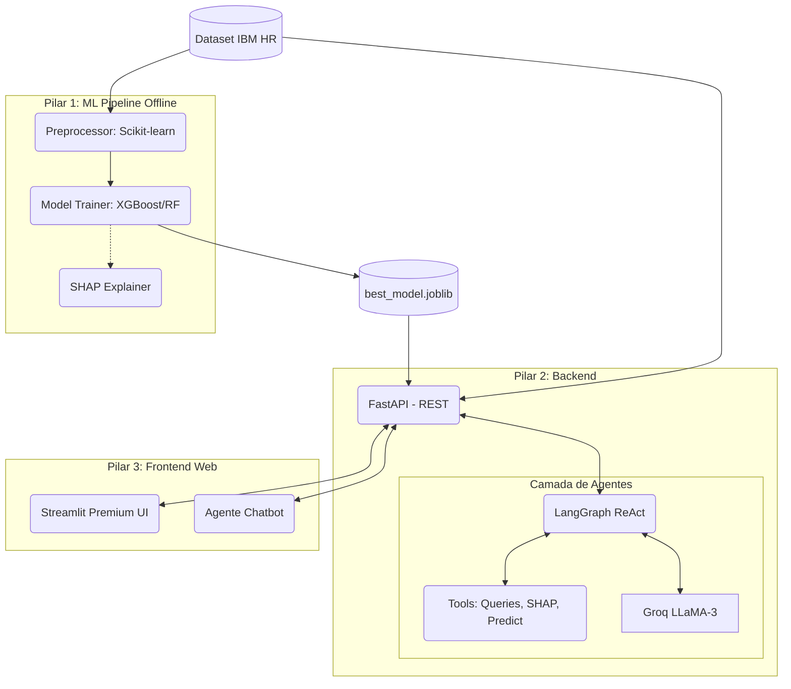

# Arquitetura da Solução: Neural HR & Retention

A aplicação foi desenhada visando a desacoplagem das camadas *(Separation of Concerns)*, de modo a permitir que o modelo preditivo seja escalado via Docker e possa ser consumido simultaneamente por dashboards (Streamlit) e outros sistemas através da API Central (FastAPI).

## Diagrama Funcional

O fluxo arquitetural é dividido em **3 Pilares**:
1. E.T.L. & Modelagem *(Treinamento Offline)*
2. Orquestração Backend & IA *(Serviço Vivo)*
3. Front-End Visual *(Consumo)*

## Descrição das Camadas

1. **Camada de Dados & Processamento:** Arquivos crus da IBM carregados como *pandas DataFrame*. Pipelines do Scikit-Learn encapsulam Imputação, StandardScaler e OneHotEnconding em arquivos passíveis de serialização, impedindo risco lógico e *data leakage*. O SMOTE opera com oversampling mitigando desbalanceamentos das perdas.

2. **Treinamento e Modelo:** Escolha nativa de múltiplos modelos, prevalesce os baseados em árvores pela natureza tabular e alta interpretação de SHapley Values (SHAP), salvos de modo reprodutível através de binários `joblib`.

3. **Inbound/Outbound Backend (FastAPI):** Camada de ponte que recebe comandos Pydantic validados estruturalmente. Roteia tráfego para ML Predict ou LLM. O uso de Assincronia do FastAPI em produção lida melhor com alto *throughput*.

4. **Service GenAI (Orquestração IA):** LangChain gerencia o Prompter e os outputs forçados via JSON (Pydantic Parsers), injetando métricas numéricas do SHAP para dentro do contexto do LLaMA 3 (via Groq API). A Memória reativa fica conectada ao LangGraph para suportar o Agentic Workflow.

5. **Apresentação User-Facing (Streamlit):** Uma UI em nuvem de baixa latência e alto refino arquitetural que esconde a complexidade de APIs do Gestor de RH por trás de uma estética "dark mode", gerando métricas globais Altair/Plotly.
